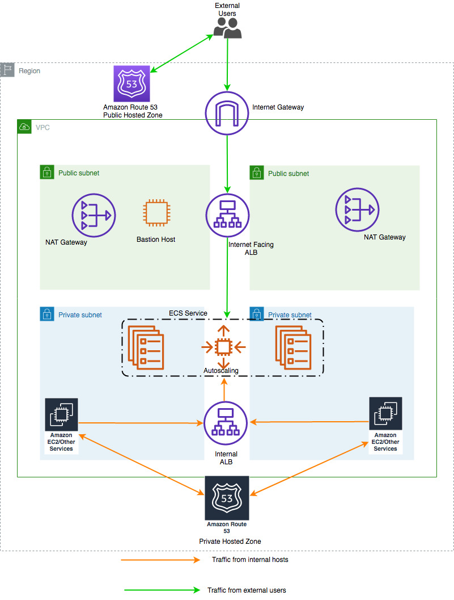

# Multiple load balancer Target Group Support for Amazon ECS to access internal and external service endpoint using the same DNS name using CDK

Container-based applications on Amazon ECS using Amazon EC2 (commonly referred to as EC2) or AWS Fargate, frequently need to expose the application to both external clients and internal clients within the Amazon VPC (commonly referred to as VPC).

Objective of this project is to guide with setting up a single ECS service as target for two load balancers(Internal and External) using CDK.

By using the code below, one will be able to create the folowing resources.

- [VPC](https://docs.aws.amazon.com/cdk/api/v2/docs/aws-cdk-lib.aws_ec2.Vpc.html)

- 2 [Security Groups](https://docs.aws.amazon.com/cdk/api/v2/docs/aws-cdk-lib.aws_ec2.SecurityGroup.html) (one for internal and one for external)

- 2 [Load Balancers](https://docs.aws.amazon.com/cdk/api/v2/docs/aws-cdk-lib.aws_elasticloadbalancingv2.ApplicationLoadBalancer.html) (one each for internal and external)

- 2 [Target Groups](https://docs.aws.amazon.com/cdk/api/v2/docs/aws-cdk-lib.aws_elasticloadbalancingv2.ApplicationTargetGroup.html) (one each for internal and external Load Balancer)

- 2 [Listeners](https://docs.aws.amazon.com/cdk/api/v2/docs/aws-cdk-lib.aws_elasticloadbalancingv2.ApplicationListener.html) (one each for internal and external Load Balancer)

- [ECS Cluster](https://docs.aws.amazon.com/cdk/api/v2/docs/aws-cdk-lib.aws_ecs.Cluster.html)

- [Task definition](https://docs.aws.amazon.com/cdk/api/v2/docs/aws-cdk-lib.aws_ecs.FargateTaskDefinition.html)

- [ECS Service](https://docs.aws.amazon.com/cdk/api/v1/docs/@aws-cdk_custom-resources.AwsCustomResource.html) using Custom Resource


## Reason behind using Custom Resource for creating a ECS Service

- We are using Custom Resource in CDK to create the ECS service as the attachment of single service to 2 Target Groups is not supported natively by CDK/CFN/Console.

- Currently, it is only supported using the CLI or SDK, so in order to implement this, we are using a Custom Resource which in turn will call the `CreateService` API call for us.

## Architecture Diagram:



- Please note, the above diagram is the best practice, and is suggested by AWS to be followed, but the CDK code given in this project doesn't include a Route 53 Public/Private Hosted Zone for the DNS configuration and is a feature request for now.

- For more details, please refer the [AWS Documentation](https://aws.amazon.com/blogs/containers/how-to-use-multiple-load-balancer-target-group-support-for-amazon-ecs-to-access-internal-and-external-service-endpoint-using-the-same-dns-name/).

## How to deploy:

* Open 'bin/ecs_with_cdk-stack.ts' and edit the account id and the region you want to deploy the resources to.

* Run 
```
cdk synth
```

* Run 
```
cdk deploy
```
